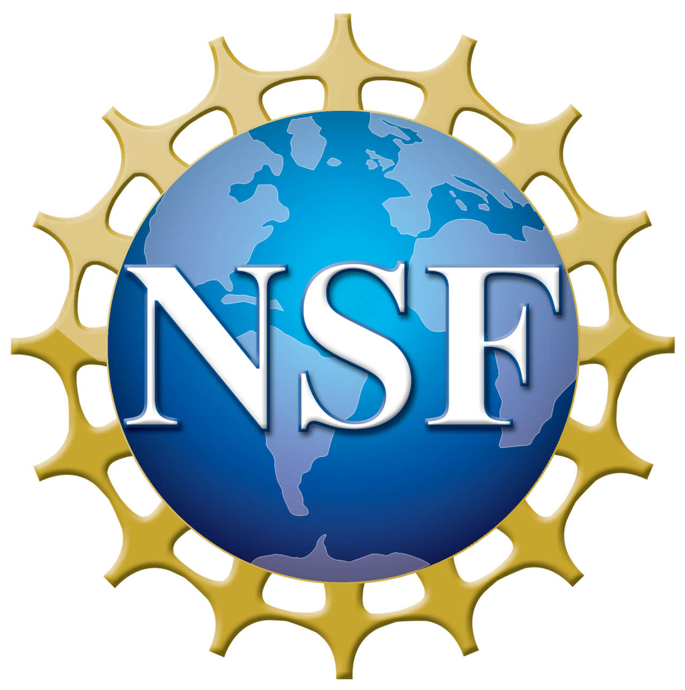



<!---
My research interests lie in applied mathematics and scientific computing, in particular, multi-scale modeling with applications to fluid physics, materials science, and biophysics. The research goal is to establish accurate modeling of multi-scale systems relevant to meso-scale transport, non-Newtonian hydrodynamics, and kinetic transport processes arising from various science and engineering applications. For such problems, the multi-scale and high-dimensional nature imposes a fundamental challenge; empirical models based on ad-hoc closure assumptions often show limitations. Currently, my group is devoted to constructing machine-learning based models for such systems directly from the first-principle-based descriptions. In particular, we focus on developing numerical methods to learn reliable and numerically-stable models that faithfully entail the micro-scale interactions, retain physical interpretation, and respect physical constraints. The long-term goal is to achieve predictive modeling of these multi-scale systems beyond phenomenologically understanding and establish integrated control across multiple scales.

+ Machine learning methods for multi-scale modeling 
+ Model reduction and stochastic simulation
+ Scientific machine-learning
+ Fluid physics
-->

My research focuses on **computational mathematics**, particularly in **scientific machine learning** (SciML) and **multi-scale modeling** related to fluid physics, materials science, and biophysics. As part of the broader field of **AI for Science**, I develop numerical algorithms for constructing accurate and structure-preserving ML-based models of multi-scale systems directly from the first-principle-based descriptions. My research goal is to establish accurate modeling of multi-scale dynamical systems relevant to non-Newtonian hydrodynamics, non-equilibrium kinetic processes, and meso-scale stochastic reduced dynamics, which are central to various science and engineering applications. 

Research Overview
===

Accurate modeling of multi-scale systems has been a long-standing problem in both computational mathematics and broad scientific applications. A fundamental challenge arises from their multi-scale nature and high-dimensionality. There is generally no simple set of modes that can be used to project and predict the dynamics in a self-contained manner. Existing approaches often rely on sophisticated micro-macro coupling and empirical constitutive closures.  Despite their broad applications, these empirical models generally show limitations in retaining the molecular-level interactions. Currently, there is still a lack of reliable models to quantify complex multi-scale processes by faithfully modeling the micro-interactions in a transferable and integrated manner.

Recent progress in the machine learning (ML) approach, with its unprecedented capability to approximate high-dimensional functions, has opened up many new possibilities in computational science.  Meanwhile, ML is often perceived as a "black-box" approach lacking fundamental principles. This has been an essential obstacle to making further progress in physical modeling and scientific computing. To construct truly reliable ML-models for multi-scale problems, fundamental challenges remain: (1) How to effectively transfer micro-scale physical laws across scales while retaining physical interpretability; (2) How to strictly preserve the physical constraints and mathematical structures of the ML-based partial and ordinary differential equations (PDEs and ODEs) that ensures the well-posedness and numerical stability? 

My research aims to address these challenges by developing numerical algorithms for constructing accurate ML-based models of multi-scale systems directly from first-principle-based descriptions. As part of the AI for Science initiative, a key objective is to retain the micro-model fidelity while strictly preserving canonical structures and symmetry constraints. Examples include hydrodynamics of multi-scale fluids, kinetic transport, and mesoscale stochastic reduced dynamics. The long-term goal is to enable predictive modeling of multi-scale systems that extends beyond phenomenological understanding, facilitating integrated control across multiple scales.

Research Interests
===
+ Scientific machine-learning 
+ Multi-scale modeling 
+ Model reduction and stochastic simulation

We are grateful for grant support 
from [NSF](https://www.nsf.gov/), [DOE](https://www.energy.gov/), [Ford](https://www.ford.com/), and [MSU Foundation](https://www.msufoundation.org/). 

